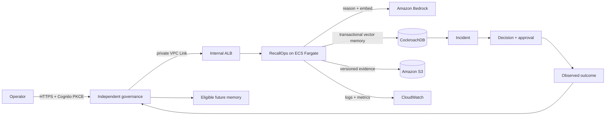

# Architecture decision record: outcome-conditioned memory

## Decision

Use CockroachDB as the single system of record for operational incident state, vector memories, approvals, and audit evidence. Rank retrieved memories using semantic similarity, observed outcome, service-version compatibility, and confidence.

## Why

A semantically similar remediation can be dangerous when it applies to another tenant or software version. Retrieval therefore cannot be the authorization mechanism. Tenant filtering occurs before ranking; invalid memories are excluded; compatibility affects rank; mutating actions require explicit approval.

Keeping operational rows and embeddings in one transactional database avoids consistency gaps between an incident record and a separate vector store. A tenant and service prefix on the vector index aligns index filtering with the dominant retrieval boundary. An observed outcome is linked to exactly one source incident, making retries idempotent and preserving the causal provenance of learned memory.

Every analysis returns an ordered, typed agent trace for embedding, governed retrieval,
and evidence-grounded reasoning. Each step records read-only risk, bounded attempts and
timeouts, status, privacy-preserving input digest, and evidence identifiers. The stored
incident supplies the replay input while the digest detects drift without duplicating
potentially sensitive symptoms into telemetry.

## Memory governance

Observed outcomes enter `pending_review` with the observer identity and are excluded from retrieval.
Activation requires a different reviewer. Active memories can be quarantined, revoked, or superseded;
supersession requires an active replacement in the same tenant. Terminal memories cannot silently
re-enter circulation. Every accepted transition and its actor, reason, prior state, and next state is
written to `memory_events` in the same transaction as the memory update.

Positive outcome evidence and confidence decay with a 180-day half-life. Negative outcome evidence
retains its full penalty: age does not make a known failed remediation safe. Decay changes ranking,
not history; original observations remain immutable and auditable.

## Alternatives

- Separate vector database: mature and flexible, but adds synchronization and operational failure modes without benefit to this scope.
- Conversation transcripts only: simple, but cannot represent outcomes, supersession, or authorization evidence safely.
- Fully autonomous remediation: compelling demo, but an unjustified security and reliability risk before allowlisted execution and postcondition verification exist.

## Current boundary

The service proposes and records decisions but does not execute infrastructure mutations. It closes
the memory lifecycle with quarantined learning, independent review, revocation, supersession, and
confidence decay. Production identity is verified with signed OIDC access tokens and tenant scope is
derived from immutable claims. Allowlisted execution adapters and postcondition verification remain
future vertical increments; until they exist, mutation stays behind explicit human approval.

