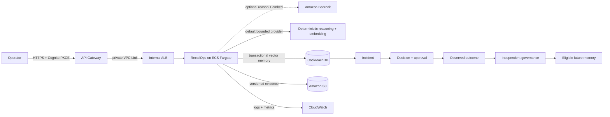

# Architecture decision record: outcome-conditioned memory

## Decision

Use CockroachDB as the single system of record for operational incident state, vector memories, approvals, and audit evidence. Rank retrieved memories using semantic similarity, observed outcome, service-version compatibility, and confidence.

## Why

A semantically similar remediation can be dangerous when it applies to another tenant or software version. Retrieval therefore cannot be the authorization mechanism. Tenant filtering occurs before ranking; invalid memories are excluded; compatibility affects rank; mutating actions require explicit approval.

Keeping operational rows and embeddings in one transactional database avoids consistency gaps between an incident record and a separate vector store. A tenant and service prefix on the vector index aligns index filtering with the dominant retrieval boundary. An observed outcome is linked to exactly one source incident, making retries idempotent and preserving the causal provenance of learned memory.

Database authorization is split by workload. A migration owner manages schema; the API and outbox
worker use separate `NOLOGIN` role bundles with exact table privileges. ECS supplies the owner URL
only to a one-shot migrator, the API URL only to the API container, and the outbox URL only to a
dedicated delivery container after migration succeeds.
Composite tenant foreign keys prevent cross-tenant provenance and governance relationships even
through direct SQL. Row visibility remains application-enforced because one pooled SQL principal
serves multiple tenants; native CockroachDB RLS is intentionally not claimed without a trusted
per-request database identity. The exact guarantee and executable evidence are documented in
[`DATABASE_SECURITY.md`](DATABASE_SECURITY.md).

Every analysis returns an ordered, typed agent trace for embedding, governed retrieval,
and evidence-grounded reasoning. Each step records its actual risk classification, bounded attempts and
timeouts, status, privacy-preserving input digest, and evidence identifiers. The stored
incident supplies the replay input while the digest detects drift without duplicating
potentially sensitive symptoms into telemetry.

## Memory governance

Observed outcomes enter `pending_review` with the observer identity and are excluded from retrieval.
Activation requires a different reviewer. Active memories can be quarantined, revoked, or superseded;
supersession requires an active replacement in the same tenant. Terminal memories cannot silently
re-enter circulation. Every accepted transition and its actor, reason, prior state, and next state is
written to `memory_events` in the same transaction as the memory update.

Positive outcome evidence and confidence decay with a 180-day half-life. Negative outcome evidence
retains its full penalty: age does not make a known failed remediation safe. Decay changes ranking,
not history; original observations remain immutable and auditable.

Compatibility is an explicit, versioned memory policy rather than an inferred string heuristic.
`exact` permits only the identical service version; `semver_patch` permits another patch in the same
major/minor line; and `semver_minor` permits another minor in the same major line. Unknown version
formats never gain non-exact authorization. The policy and its implementation version are persisted
with the memory and included in every reasoning envelope so policy changes remain replayable.

## Alternatives

- Separate vector database: mature and flexible, but adds synchronization and operational failure modes without benefit to this scope.
- Conversation transcripts only: simple, but cannot represent outcomes, supersession, or authorization evidence safely.
- Fully autonomous remediation: compelling demo, but an unjustified security and reliability risk before allowlisted execution and postcondition verification exist.

## Current boundary

The optional AWS diagnostic provider adds two finite read-only steps before reasoning: one
`DescribeAlarms` request and one `DescribeServices` request. Targets are derived from
deployment-owned prefixes and validated tenant/service identities, so incident input cannot
supply ARNs, queries, or operation names. Only bounded status fields and opaque evidence URNs
are persisted. Each dependency degrades independently, and the provider remains disabled
unless all deployment prefixes are configured.

The service proposes and records decisions but does not execute infrastructure mutations. The current
demo's execution endpoint is an operator attestation, not proof that infrastructure ran. Elevated
evidence claims fail closed unless the server verifies an OK CloudWatch alarm or an object in the
configured evidence bucket. It closes the memory lifecycle with pending-review learning,
independent review, revocation, supersession, and confidence decay. Production identity is verified
with signed OIDC access tokens and tenant scope is derived from immutable claims. Allowlisted execution
execution adapters and automatic postcondition collection remain future vertical increments; until
they exist, mutation stays behind explicit human approval and evidence strength is labeled accordingly.

```mermaid
flowchart LR
  O[Operator] -->|HTTPS + Cognito PKCE| GW[API Gateway]
  GW -->|private VPC Link| L[Internal ALB]
  L --> A[RecallOps on ECS Fargate]
  A -.->|optional reason + embed| B[Amazon Bedrock]
  A -->|default bounded provider| D[Deterministic reasoning + embedding]
  A -->|transactional vector memory| C[(CockroachDB)]
  A -->|versioned evidence| S[(Amazon S3)]
  A -->|logs + metrics| W[CloudWatch]
  C --> I[Incident]
  I --> P[Decision + approval]
  P --> U[Observed outcome]
  U --> GOV[Independent governance]
  GOV --> M[Eligible future memory]
```
